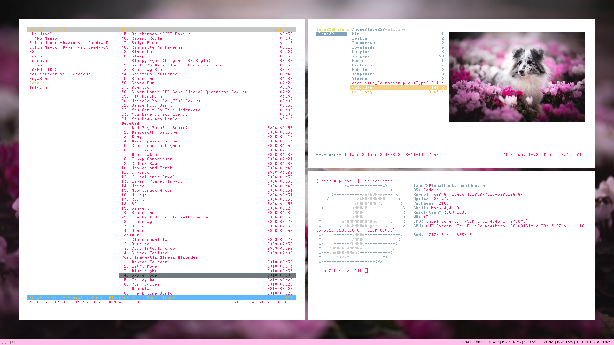

# Personal i3 config
Personal i3 config
## Dependencies
- i3
- Compton
- i3 gaps
- conkyrc
- feh
- cmus
## Installation
- Run ``./thisfirst.sh`` as root
- Run ``./second.sh`` not as root 
- Finally run ``./config.sh`` not as root 
# Screenshot

# Wallpaper
If you want to replace the wallpaper just replace the ``wall.jpg `` with another picture

